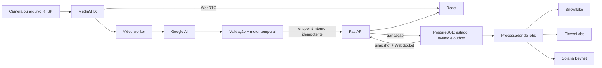

# Plano de Desenvolvimento, Implementação e Testes — DogSense Live

**Versão:** 1.0  
**Documento-base:** `PRD Técnico — DogSense Live.md`, versão 1.0  
**Escopo:** MVP P0 para o Weekend Challenge  
**Situação inicial:** greenfield; o workspace contém apenas o PRD  

## 1. Resultado esperado

Entregar um MVP reproduzível por Docker Compose que execute o fluxo completo:

```text
Câmera ou vídeo RTSP
  → vídeo WebRTC no navegador
  → análise temporal com Google AI
  → estabilização do estado provável
  → atualização da interface e persistência do evento
  → sincronização Snowflake
  → áudio ElevenLabs sob demanda
  → receipt verificável na Solana Devnet
```

O vídeo deve permanecer disponível mesmo quando a IA ou qualquer integração externa estiver degradada. O sistema deve exibir sinais observáveis e incerteza, sem diagnosticar ou afirmar emoções como certeza.

## 2. Premissas e corte de escopo

### 2.1 Premissas do plano

- Um usuário de demonstração, um cachorro e uma câmera ativa.
- Agente, backend, frontend, MediaMTX e PostgreSQL executados no mesmo host.
- H.264/RTSP como caminho principal e vídeo controlado publicado como RTSP para fallback.
- Frames usados na inferência apenas em memória; gravação de vídeo desabilitada.
- PostgreSQL como fonte transacional da verdade; Snowflake como destino analítico.
- Inglês como idioma da demonstração; infraestrutura preparada para `pt-BR`.
- Serviços externos acessados por adaptadores substituíveis por fakes em desenvolvimento e CI.
- Estimativa de referência: 17–26 pessoa-dias, recalibrada após os spikes técnicos da Fase 0.

### 2.2 P0 que não pode ser cortado

- Cadastro e teste da câmera RTSP.
- Vídeo ao vivo e start/stop do monitoramento.
- Ring buffer, amostragem temporal, análise Google AI e validação de schema.
- Estado, atividade, confiança, duração, evidências e statuses técnicos.
- Estabilização temporal e eventos consolidados.
- PostgreSQL, timeline, WebSocket e fila durável de integrações.
- Sincronização Snowflake.
- Leitura manual pelo ElevenLabs.
- Criação manual e verificação de receipt na Solana Devnet.
- Fonte de vídeo controlada, degradação segura, observabilidade mínima e cenários E2E A–E.
- Proteção de credenciais e comprovação de que vídeo/frames não são persistidos.

### 2.3 Fora do corte inicial

P1 e P2 ficam atrás de feature flags ou no backlog: alerta automático, feedback, resumos e gráficos, exportação JSON, tradução completa, browser TTS, Grafana/Streamlit, múltiplas câmeras, Edge Agent separado, áudio como sinal de entrada, notificações e modelo próprio.

## 3. Decisões a fechar antes de codificar

Esses itens formam o **Gate G0**. Nenhum deles exige ampliar o escopo, mas todos afetam contratos ou critérios de aceite.

| ID | Lacuna do PRD | Decisão recomendada para o MVP |
|---|---|---|
| D-01 | Atualização abaixo de 5 s conflita com inferência p95 de até 8 s e retry | Medir `fim da janela → renderização`; buscar p95 ≤ 5 s para chamadas bem-sucedidas. Tratar 8 s como timeout de falha, não como meta. Se o spike não atingir isso, ajustar formalmente o SLO antes do aceite. |
| D-02 | Canal entre worker e API não definido | Endpoint interno autenticado e idempotente. Enviar `analysis_id`, `session_id`, `camera_id`, `captured_at` e `transition_seq`; rejeitar duplicados e mensagens atrasadas. |
| D-03 | Fonte da timeline não definida | Timeline operacional sempre no PostgreSQL. Snowflake atende somente analytics e nunca bloqueia a interface ao vivo. |
| D-04 | JWT e token local aparecem como alternativas | JWT para qualquer ambiente acessível; token fixo apenas em localhost/dev, com inicialização proibida em modo público/produção. Autenticar também o WebSocket. |
| D-05 | Receipt manual ou automático | Criação manual é P0; automática é P1. Permitir receipt apenas de evento encerrado e guardar o snapshot canônico imutável usado no hash. |
| D-06 | Normalização numérica do JSON canônico é ambígua | Adotar canonicalização determinística documentada, preferencialmente JCS/RFC 8785, definir precisão de decimais e manter vetores dourados. |
| D-07 | Armazenamento do áudio não definido | Volume local protegido e expirável no MVP; metadados no PostgreSQL; TTL de 24 h. Não armazenar binário no banco. |
| D-08 | Qualidade da classificação não tem meta | Criar conjunto pequeno de clipes licenciados e rubricados; medir concordância, taxa de `indeterminate` e falsos alertas. Testes com IA real são canários, não gates determinísticos de CI. |
| D-09 | WebRTC fora da LAN não está especificado | Validar primeiro a topologia real da demonstração. STUN/TURN só entra no MVP se o spike provar necessidade. Fixar navegador e hardware de referência. |
| D-10 | Retenção e tratamento de dados externos não definidos | Registrar retenção por tipo de dado, confirmar políticas do provedor e documentar consentimento/minimização antes do ensaio com vídeo real. |

## 4. Arquitetura de implementação recomendada



### 4.1 Regras arquiteturais

- Pipeline de vídeo é independente do pipeline de inferência.
- A API persiste antes de publicar no WebSocket.
- O worker mantém o motor temporal, conforme a estrutura do PRD, e reidrata ou encerra explicitamente a sessão após restart.
- O PostgreSQL guarda `CurrentState`, `StateEvent` e uma outbox transacional.
- No MVP, processar a outbox com jobs PostgreSQL e `FOR UPDATE SKIP LOCKED`; não adicionar Redis/NATS sem necessidade comprovada.
- Contratos seguem uma única origem: modelos Pydantic → JSON Schema → tipos TypeScript gerados.
- `monitoring_status`, `activity` e `state` são domínios separados.
- Inferências brutas não são persistidas por padrão.
- Snowflake usa `MERGE` idempotente por `EVENT_ID`; voz e Solana usam chaves de deduplicação próprias.
- IDs analíticos devem ser pseudonimizados com HMAC e chave dedicada, não com hash simples de identificadores previsíveis.

## 5. Trilhas de trabalho

| Trilha | Responsabilidade principal | Pode iniciar |
|---|---|---|
| A — Vídeo e IA | MediaMTX, RTSP/WebRTC, worker, amostragem, Google AI, motor temporal | Após contratos mínimos da Fase 0 |
| B — API e dados | FastAPI, PostgreSQL, autenticação, eventos, WebSocket, outbox e integrações | Desde a Fase 1 |
| C — Web e qualidade | React, player, estados de UI, timeline, testes E2E e acessibilidade | Desde a Fase 1, usando mocks |
| Transversal | Segurança, observabilidade, CI, privacidade e documentação | Em todas as fases |

## 6. Roadmap de desenvolvimento e implementação

### Fase 0 — Escopo, contratos e spikes

**Esforço:** 0,5–1 pessoa-dia  
**Objetivo:** remover incertezas de alto risco antes de formar dependências no código.

Entregas:

- Matriz P0/P1 e rastreabilidade FR/NFR → teste.
- ADRs para D-01 a D-10.
- Enums e schemas versionados de análise, ingestão interna, estado, evento, WebSocket, speech e receipt.
- Fixtures válidas e inválidas para todos os estados e statuses.
- Spikes time-boxed de:
  - RTSP/H.264 → MediaMTX → WebRTC nos navegadores-alvo;
  - structured output e latência do Google AI;
  - conexão e `MERGE` no Snowflake;
  - memo e confirmação na Solana Devnet.
- Fonte real e vídeos controlados identificados, com licença e checksum.

**Gate G0:** contratos aprovados, credenciais de sandbox disponíveis, topologia da demo conhecida e SLO de latência resolvido ou explicitamente revisado.

### Fase 1 — Fundação operacional

**Esforço:** 1–2 pessoa-dias  
**Dependência:** G0.

Entregas:

- Monorepo conforme o PRD: `apps/web`, `services/api`, `services/video-worker`, `packages/contracts`, `infra`, `snowflake`, `demo` e `docs`.
- Docker Compose com `web`, `api`, `video-worker`, `mediamtx` e `postgres`.
- Configuração tipada por ambiente e `.env.example` sem valores reais.
- Migrações, seed do usuário/cachorro de demonstração e comandos `make`.
- `/health/live`, `/health/ready` e status inicial das integrações.
- Logs JSON, IDs de correlação e métricas-base.
- CI com lint, formatação, typecheck, unitários iniciais, build, migrações, secret scan e dependency scan.
- Rede Docker privada e imagens com versões fixadas.

**Gate G1:** em ambiente limpo, `docker compose up --build` sobe o stack; migração e seed são idempotentes; todos os serviços obrigatórios ficam saudáveis.

### Fase 2 — Vertical de câmera e vídeo

**Esforço:** 2–3 pessoa-dias  
**Dependência:** G1.

Entregas:

- Abstração de fonte RTSP real e arquivo em loop publicado como RTSP.
- Cadastro, atualização e teste da câmera.
- Teste bem-sucedido somente após cinco frames válidos; retornar preview transitório, codec, resolução, FPS e tempo do primeiro frame.
- Configuração dinâmica do path `dog-camera` no MediaMTX.
- Player WebRTC, indicador `LIVE`, horário do último frame e start/stop.
- Reconexão com backoff de 1–30 s e status `camera_offline`.
- Detecção de stream congelado por timestamp/FPS/hash visual.
- Ring buffer limitado, resize, deduplicação, amostragem e fila `latest-only` de uma janela.
- Sanitização completa de credenciais e URLs em APIs e logs.

**Testes/gate G2:** vídeo local p95 < 3 s no hardware de referência; queda e retorno da fonte sem reload; cinco frames validam a câmera; frames não aparecem em arquivos, banco, logs ou artefatos.

### Fase 3 — Google AI e contrato comportamental

**Esforço:** 2–3 pessoa-dias  
**Dependência:** G2; frontend pode avançar com fixtures em paralelo.

Entregas:

- Prompt `behavior-observer-v1` e schema `behavior-analysis-v1` versionados.
- Adaptador com modelo configurável, timeout, uma única tentativa adicional e telemetria sem conteúdo visual.
- Seleção de 6–8 frames em janela de 4 s; configuração inicial 640×360, 2 FPS e JPEG 75.
- Validação Pydantic estrita, allowlists de enums, limite de sinais e filtro de `summary`.
- Descarte de respostas referentes a janela obsoleta.
- Fake determinístico e fixtures para todos os estados, zero/múltiplos cachorros, baixa qualidade, campos extras, payload inválido e timeout.
- Canário com clipes controlados e modelo real, separado do gate de CI.

**Gate G3:** saída inválida ou timeout não altera o estado nem interrompe vídeo/monitoramento; cada análise válida carrega versões de modelo, prompt e schema; não há mais de uma inferência em voo.

### Fase 4 — Motor temporal, eventos, API e tempo real

**Esforço:** 2–3 pessoa-dias  
**Dependência:** G3.

Entregas:

- EWMA com `alpha = 0,35`, persistência de dois resultados, limiar 0,65 e margem 0,10.
- Regras de `indeterminate`, visibilidade insuficiente, cachorro ausente, múltiplos cachorros e serviço degradado.
- Abertura/encerramento de eventos e cálculo de duração/confiança agregada.
- Entidades e constraints para câmera/sessão/evento únicos e análises idempotentes.
- Transação única de `CurrentState` + `StateEvent` + outbox.
- Endpoint interno autenticado; rejeição de duplicados, atrasados e fora de ordem.
- REST de estado atual e eventos; WebSocket autenticado com snapshot, sequência, heartbeat e reconexão.
- Recuperação após refresh e semântica explícita de restart do worker.

**Gate G4:** uma divergência isolada não muda o estado; testes de borda dos limiares passam; eventos permanecem consistentes com replay, restart, duplicidade e mensagens fora de ordem; WebSocket só publica dados já persistidos.

### Fase 5 — Dashboard P0

**Esforço:** 2–3 pessoa-dias  
**Dependência:** contratos desde G0; integração final após G4.

Entregas:

- Tela de configuração/teste da câmera.
- Dashboard responsivo com vídeo, status, estado provável, atividade, confiança, duração, evidências e timeline.
- Estados `starting`, `analyzing`, `camera_offline`, `stream_unstable`, `dog_not_visible`, `multiple_dogs_detected`, `insufficient_visibility` e `service_degraded`.
- Ações P0: ouvir estado, criar receipt e verificar receipt.
- Reconexão sem duplicar timeline; duração derivada de `started_at`, não do relógio do servidor de vídeo.
- Infraestrutura i18n, copy sem alegações médicas e apresentação não dependente apenas de cor.
- Loading, vazio, erro e controles de áudio acessíveis.

**Gate G5:** E2E com backend e IA simulados passa em desktop e mobile; todos os statuses são distinguíveis por texto/ícone; refresh recupera estado e timeline consistentes.

### Fase 6 — Integrações externas em paralelo

**Esforço:** 3–5 pessoa-dias no total  
**Dependência:** modelo de eventos/outbox de G4.

#### 6A. Snowflake

- Criar tabela, view, credenciais de menor privilégio e migrações.
- Pseudonimizar IDs com HMAC.
- Consumir outbox em lotes de até 20 a cada 5 s, com backoff, jitter e status operacional.
- Usar `MERGE` idempotente por `EVENT_ID`; permitir enriquecimento posterior de voz/receipt.
- Manter eventos pendentes no PostgreSQL durante indisponibilidade.

#### 6B. ElevenLabs

- Templates allowlisted por estado/idioma; nunca narrar texto livre do modelo.
- Persistir o texto auditável antes da chamada.
- Cache/deduplicação por evento, idioma, voz, modelo e versão do template.
- Volume protegido com TTL de 24 h e rate limit.
- Manter texto e UI funcionais em falha.

#### 6C. Solana

- Canonicalizar snapshot de evento encerrado, calcular SHA-256 e publicar memo na Devnet.
- Unique constraint por `(event_id, canonical_version, network)`.
- Estados `pending`, `confirmed` e `failed`; keypair apenas no backend.
- Verificar hash local, snapshot e memo on-chain.
- Não publicar nome, URL, endereço doméstico, credencial ou frame.

**Gate G6:** cada integração passa com fake e smoke real controlado; indisponibilidade não afeta o vídeo; replay não duplica eventos, áudios ou transações; receipts alterados falham na verificação.

### Fase 7 — Hardening, aceite e preparação da demo

**Esforço:** 3–4 pessoa-dias  
**Dependência:** G2–G6.

Entregas:

- Métricas do PRD, correlação ponta a ponta e painel operacional mínimo.
- Fault injection para câmera, Google AI, Snowflake, ElevenLabs e Solana.
- Testes de performance, soak, memória, filas, reconexão e recuperação.
- JWT/refresh, CORS/Origin restritos, autorização por objeto e rate limit.
- Criptografia versionada de credenciais; redaction e validação segura de URL RTSP/RTSPS, incluindo risco de SSRF.
- Testes de acessibilidade, responsividade e navegadores-alvo.
- README, runbook, política de dados, roteiro de demonstração e procedimentos de contingência.
- Ensaio com fonte real e fonte controlada.

**Gate G7 / release:** todos os P0 rastreados e verdes; nenhum defeito Sev-1/Sev-2; logs e artefatos sem secrets/frames; três execuções consecutivas do roteiro; fallback e recuperação demonstrados.

## 7. Dependências e caminho crítico

```text
G0 contratos/spikes
  → G1 fundação
  → G2 vídeo
  → G3 IA
  → G4 estado/eventos/WebSocket
  → G5 dashboard integrado
  → G7 aceite
```

Depois de G4, Snowflake, ElevenLabs e Solana podem avançar em paralelo. O frontend pode ser construído desde G0 com contratos e MSW/fakes. Segurança, testes e observabilidade acompanham cada entrega e não são postergados integralmente para a Fase 7.

## 8. Rastreabilidade de requisitos

| Requisitos | Fase principal | Evidência mínima de teste |
|---|---|---|
| FR-001–FR-004 | F2/F5 | API + componente + E2E de cadastro, teste, vídeo e start/stop |
| FR-005–FR-007 | F2/F3 | Unitário de buffer/amostragem + contrato Google AI + integração MediaMTX/worker |
| FR-008–FR-013 | F3/F4/F5 | Contrato, relógio virtual, transições determinísticas e E2E de dashboard |
| FR-014–FR-015 | F2/F4/F5 | Fault injection de câmera e E2E de cachorro ausente |
| FR-016–FR-017 | F4/F6A | Integração PostgreSQL/outbox/Snowflake + E2E de timeline |
| FR-018 | F6B | Template, cache, rate limit, mock/real smoke e reprodução acessível |
| FR-019–FR-020 | F6C | Vetores dourados, idempotência concorrente, Devnet smoke e adulteração |
| NFR-001–NFR-005 | F2–F7 | Performance, WebSocket, reconexão e fault injection |
| NFR-006–NFR-008 | Todas | Secret/privacy scan e testes de degradação |
| NFR-009–NFR-012 | F1/F7 | Compose limpo, logs/métricas, idempotência e fila limitada |
| NFR-013–NFR-015 | F5/F7 | Viewports, teclado/axe, texto além de cor e smoke EN/PT-BR |

## 9. Estratégia de testes

### 9.1 Pirâmide

| Camada | Proporção de referência | Conteúdo | Execução |
|---|---:|---|---|
| Análise estática | — | lint, format, typecheck, schemas, migrações, SAST, secrets e dependências | Todo PR |
| Unitários | 65% | buffer, sampling, schema, motor temporal, eventos, templates, hash, redaction, autorização e componentes | Todo PR |
| Contrato/componente | 20% | Google AI, REST, WebSocket e adaptadores externos com fakes | Todo PR |
| Integração | 10% | RTSP→MediaMTX→worker, API→PostgreSQL/outbox e jobs→fakes | PR/branch principal |
| E2E | 5% | Fluxos P0 no navegador com vídeo e IA determinísticos | Branch principal/release |
| UAT/exploratório | — | qualidade semântica, dispositivo, câmera e serviços reais | Release candidate |

Meta sugerida: cobertura de branches ≥ 90% para motor temporal, contratos, canonicalização, idempotência e redaction; ≥ 80% para o restante do backend/worker. Os cenários de borda têm precedência sobre o número de cobertura.

### 9.2 Ferramentas sugeridas

- Python: `pytest`, relógio falso, testes property-based, mocks HTTP e containers efêmeros.
- React: Vitest, React Testing Library, MSW e axe.
- E2E: Playwright com Chromium como gate; Firefox/WebKit na matriz estendida.
- Mídia: FFmpeg/stream RTSP controlado e arquivos imutáveis com checksum.
- Contratos: OpenAPI, JSON Schema e fixtures versionadas.

### 9.3 Dados de teste

O catálogo versionado deve conter:

- repouso, brincadeira, alerta e movimento repetitivo;
- transições entre estados;
- nenhum cachorro e múltiplos cachorros;
- oclusão parcial, distância, baixa luz e desfoque;
- FPS variável, resoluções/codecs suportados, congelamento e interrupção;
- duração suficiente para estabilização e encerramento de eventos.

Cada vídeo deve registrar licença, checksum, ausência de PII, metadados e marcações esperadas por intervalo. Não se deve provocar desconforto em animais para produzir material de teste.

CI usa respostas programadas do fake de IA. O modelo real é avaliado em staging/canário porque custo, latência e não determinismo tornam inadequado usá-lo como gate de regressão.

### 9.4 Casos unitários críticos

- Ring buffer limitado, descarte de duplicados e preferência pela janela mais recente.
- Schema: scores 0/1 e fora da faixa, enum desconhecido, campo ausente, tipos incorretos, mais de cinco sinais, resumo longo, zero/múltiplos cachorros e campos extras.
- Motor temporal: `alpha=0,35`; bordas 0,6499/0,65 e 0,0999/0,10; divergência isolada; dois candidatos consecutivos; baixa qualidade; falhas por mais de 10 s.
- Evento: abertura, atualização, transição, invisibilidade >10 s, câmera offline, stop, replay, relógios divergentes e mensagens fora de ordem.
- Snowflake: lote, backoff, replay, `MERGE` e idempotência.
- Voz: templates, pluralização, auditoria, cache e chamadas concorrentes.
- Solana: ordem de chaves, UTF-8, UTC, precisão numérica, nulos, sinais ordenados, hash, memo e verificação negativa.
- Segurança: criptografia/redaction, autorização, sanitização do summary e validação de URL RTSP.

### 9.5 Cenários E2E obrigatórios

| ID | Cenário | Resultado esperado |
|---|---|---|
| E2E-01 | Repouso | `relaxed`, evidências e evento/timeline persistidos |
| E2E-02 | Repouso → alerta | Transição somente após estabilização, sem oscilação excessiva |
| E2E-03 | Sinais persistentes | `stress_signals`, áudio manual, receipt único e verificação positiva |
| E2E-04 | Cachorro fora do quadro | `dog_not_visible`, evento encerrado após regra temporal e nenhuma emoção exibida |
| E2E-05 | Perda e retorno da câmera | `camera_offline`, reconexão e retomada sem reload ou frames antigos |
| E2E-06 | IA lenta/inválida/indisponível | Vídeo continua; último estado expira para `service_degraded`; sem resultado fabricado |
| E2E-07 | Snowflake/ElevenLabs/Solana indisponíveis | Falha isolada, jobs pendentes e recuperação idempotente |
| E2E-08 | Refresh/reconexão WebSocket | Snapshot consistente e nenhuma duplicação na timeline |
| E2E-09 | Reenvio concorrente de voz/receipt | Um único ativo/transação por chave idempotente |
| E2E-10 | Privacidade | Nenhuma credencial, frame, base64 ou chave em API, logs, métricas, DB analítico ou artefatos |

### 9.6 Performance e resiliência

Medir no hardware e rede da apresentação:

- vídeo local p95 < 3 s;
- `fim da janela → estado renderizado` p95 definido em D-01;
- latência de inferência, API→WebSocket e tempo até o primeiro estado;
- FPS, CPU, memória, frames descartados, fila e chamadas/minuto;
- tempo de reconexão e ausência de frames antigos após retorno;
- drenagem da outbox, geração de áudio e confirmação Solana.

Executar normal, IA lenta, timeout, queda/congelamento RTSP, indisponibilidade isolada das integrações e recuperação. Soak de 1–2 h deve mostrar memória e filas limitadas e nenhuma degradação progressiva.

### 9.7 Segurança, privacidade e acessibilidade

- Autenticação/expiração/refresh, autorização por objeto e autenticação do WebSocket.
- CORS e Origin restritos, rate limit e endpoints administrativos protegidos.
- SSRF/protocolos indevidos na URL RTSP, SQL injection, XSS via textos, payload excessivo e content type inválido.
- Canary secrets para comprovar redaction em API, logs, métricas, Snowflake e Solana.
- Inspeção de volumes, temporários, dumps e artefatos para confirmar que frames não foram gravados.
- Carteira somente Devnet, chave privada ausente do frontend e saldo mínimo.
- Navegação por teclado, foco visível, contraste, texto/ícone além de cor, nomes acessíveis, reflow mobile e texto equivalente ao áudio.
- `aria-live` apenas para mudanças relevantes; não anunciar a duração a cada segundo.

## 10. Ambientes e automação

| Ambiente | Integrações | Finalidade |
|---|---|---|
| Local | Fakes + PostgreSQL/MediaMTX reais | Desenvolvimento rápido e determinístico |
| CI efêmero | Fakes e vídeo controlado | Checks de PR, contratos, integração e E2E headless |
| Staging | Google AI, Snowflake sandbox, ElevenLabs limitado e Devnet | Smokes reais, canários e avaliação de latência |
| Ensaio da demo | Mesmo hardware/rede/navegador da apresentação | UAT, contingência e três dry-runs completos |

Pipeline recomendado:

1. **Todo PR:** lint, format, typecheck, unitários, contratos, migrações, componentes, integração com fakes, Compose smoke, SAST, secret/dependency scan.
2. **Branch principal:** E2E P0 determinístico, imagens Docker e fault injection básico.
3. **Noturno ou sob demanda:** Firefox/WebKit, soak, performance e canários reais com limite de custo.
4. **Release candidate:** matriz de navegadores, segurança, acessibilidade manual, todos os P0, UAT e ensaio integral.

Relatórios podem guardar JUnit, cobertura, métricas e traces sem frames reais, credenciais ou vídeo doméstico.

## 11. Cronograma de referência

### 11.1 Execução sustentável

Com três trilhas paralelas e credenciais disponíveis:

| Janela | Entrega predominante |
|---|---|
| Dia 0–1 | F0 e F1: decisões, spikes, contratos e fundação |
| Dia 2–3 | F2: vídeo/câmera; shell do frontend em paralelo |
| Dia 3–5 | F3 e F4: IA, motor temporal, API, persistência e WebSocket |
| Dia 4–6 | F5: dashboard integrado |
| Dia 6–7 | F6A/F6B/F6C em paralelo |
| Dia 8–9 | F7: resiliência, segurança, performance, E2E e documentação |
| Dia 10 | Buffer, correções e ensaio final |

Para uma pessoa, planejar pela estimativa de 17–26 pessoa-dias, não pelo calendário acima.

### 11.2 Compressão para 48 horas

Viável somente com três trilhas, contas/credenciais pré-provisionadas e corte estrito de todo P1:

| Horas | Foco |
|---|---|
| 0–4 | G0, contratos, Compose e fakes |
| 4–12 | RTSP/MediaMTX/WebRTC e fonte controlada |
| 10–24 | Worker, Google AI, validação e motor temporal |
| 12–28 | API/PostgreSQL/WebSocket e dashboard com mocks, depois integração |
| 24–36 | Snowflake, ElevenLabs e Solana em paralelo |
| 36–44 | E2E A–E, falhas, privacidade, latência e correções |
| 44–48 | Três ensaios, documentação, fallback e buffer final |

Se houver atraso, cortar P1 e refinamentos visuais antes de reduzir schema, estabilização, outbox, degradação, testes A–E ou vídeo de backup.

## 12. Riscos e contingências

| Risco | Sinal antecipado | Mitigação | Contingência de demo |
|---|---|---|---|
| IA acima do SLO ou com quota | Spike p95 > meta / 429 | Reduzir resolução/frames, uma chamada em voo, latest-only, limite de custo | Fixtures/fake claramente identificado para fluxo controlado; vídeo continua ao vivo |
| RTSP/WebRTC incompatível | codec/ICE/browser falha no spike | Fixar H.264 e navegador de referência; validar rede cedo | Vídeo controlado já publicado no MediaMTX |
| Classificação instável | muitos flips ou falsos alertas | Fixtures, histerese, `indeterminate`, dataset rubricado e prompt versionado | Roteiro com clipes já validados e evidências transparentes |
| Snowflake indisponível | outbox cresce | Persistir primeiro, backoff e `MERGE` | Mostrar evento local e status pendente |
| ElevenLabs indisponível | timeout/limite | Template auditável, cache e rate limit | Exibir texto; áudio pré-cacheado apenas se produzido pelo fluxo válido |
| Solana Devnet instável | transação pendente | Receipt local, retry sob demanda e idempotência | Mostrar hash/snapshot/status pendente e uma transação previamente validada |
| Vazamento de credencial/frame | scanner/canary encontra dado | Redaction, criptografia, proibição de persistência e testes DLP | Bloquear release até correção |
| Drift do modelo/prompt | canário diverge das fixtures | Fixar configuração da demo, versionar e rodar regressão | Reverter para versão validada |
| Escopo excessivo | G4/G5 atrasados | Feature flags e corte imediato de P1 | Entregar somente o caminho P0 completo |

## 13. Definition of Done e aceite final

Uma funcionalidade só está concluída quando:

- implementação, tratamento de erro e logs estão presentes;
- teste unitário/contrato/integração aplicável está automatizado;
- contrato de API/evento está documentado e versionado;
- UI possui loading, vazio, erro e acessibilidade aplicáveis;
- nenhum secret ou frame aparece em código, resposta, log ou artefato;
- fluxo foi validado no Docker Compose;
- README/runbook e roteiro de demo foram atualizados.

O MVP entra em **go** quando:

- todos os FR P0 e NFR aplicáveis possuem teste e evidência rastreável;
- Compose sobe do zero e a migração é idempotente;
- vídeo real e fallback controlado funcionam;
- cenários E2E-01 a E2E-10 passam;
- metas de performance acordadas são atendidas no hardware de referência;
- cada integração pode falhar sem interromper o vídeo;
- não há Sev-1/Sev-2 nem vulnerabilidade crítica aberta;
- inspeção confirma ausência de vídeo persistido e credenciais expostas;
- três execuções consecutivas do roteiro terminam com sucesso.

## 14. Primeiras ações executáveis

1. Aprovar o corte P0 e as decisões D-01 a D-10.
2. Provisionar credenciais/sandboxes e identificar o hardware/rede da demo.
3. Executar os quatro spikes de G0, começando por RTSP/WebRTC e latência Google AI.
4. Congelar schemas/enums e produzir fixtures antes de implementar adaptadores.
5. Criar o monorepo e fazer `docker compose up --build` ser o primeiro incremento demonstrável.
6. Entregar uma vertical determinística com vídeo controlado + fake de IA + estado no dashboard.
7. Substituir o fake pelo Google AI, depois habilitar Snowflake, ElevenLabs e Solana como ramos independentes.
8. Rodar gates e rastreabilidade a cada fase; não acumular segurança e testes para o final.
