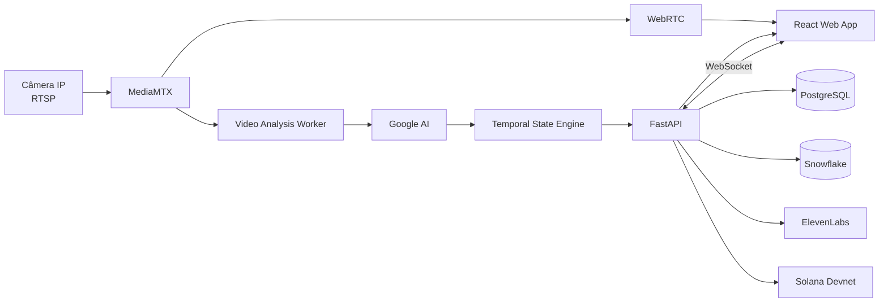

# PRD Técnico — DogSense Live

**Produto:** DogSense Live  
**Versão do documento:** 1.0  
**Status:** Pronto para implementação  
**Tipo de entrega:** MVP para o Weekend Challenge  
**Plataformas:** Aplicação web responsiva e agente local  
**Stack principal:** Python, FastAPI, React, TypeScript, PostgreSQL e Docker  
**Integrações do desafio:** Google AI, Snowflake, ElevenLabs e Solana  

---

## 1. Resumo executivo

O **DogSense Live** é uma aplicação de monitoramento comportamental canino que recebe o stream ao vivo de uma câmera IP, analisa pequenas sequências de vídeo e apresenta ao tutor o estado comportamental provável do cachorro.

A aplicação deverá mostrar:

- vídeo ao vivo;
- estado atual;
- atividade observada;
- nível de confiança;
- duração do estado;
- sinais visuais que sustentam a classificação;
- linha do tempo dos eventos;
- alertas falados;
- comprovantes verificáveis de eventos importantes.

O sistema não deverá afirmar que conhece com certeza a emoção do cachorro nem emitir diagnósticos veterinários. A interface utilizará o termo **estado provável**, derivado de sinais comportamentais observáveis.

A proposta técnica para o MVP utiliza:

| Tecnologia | Responsabilidade |
|---|---|
| Google AI | Analisar sequências de frames e extrair sinais comportamentais estruturados |
| Snowflake | Armazenar eventos e produzir histórico e análises |
| ElevenLabs | Gerar alertas falados e resumos acessíveis |
| Solana | Registrar hashes de eventos importantes para verificação de integridade |

---

## 2. Problema

Tutores que deixam seus cachorros sozinhos conseguem visualizar câmeras domésticas, mas precisam observar manualmente o vídeo para entender o que está acontecendo.

As soluções tradicionais informam apenas:

- movimento detectado;
- presença de animal;
- áudio detectado;
- gravação iniciada.

Elas não transformam o comportamento observado em informação compreensível, como:

- o cachorro está repousando;
- o cachorro está brincando;
- o cachorro está atento a algo;
- há sinais persistentes associados a estresse;
- a imagem não contém evidências suficientes para uma classificação.

O DogSense deverá interpretar o vídeo de forma contínua, temporal e explicável.

---

## 3. Visão do produto

> Transformar uma câmera IP comum em um monitor inteligente de comportamento canino, capaz de apresentar estados prováveis em tempo quase real.

A experiência principal deverá responder às seguintes perguntas:

1. Meu cachorro está visível?
2. O que ele está fazendo?
3. Qual é o estado comportamental provável?
4. Há quanto tempo esse estado persiste?
5. Quais sinais visuais sustentam essa conclusão?
6. O comportamento está diferente do padrão recente?
7. Houve algum evento importante enquanto eu não estava acompanhando?

---

## 4. Objetivos

### 4.1 Objetivos do MVP

O MVP deverá:

1. Conectar-se a uma câmera IP por RTSP.
2. Reproduzir o vídeo ao vivo no navegador.
3. Capturar sequências de frames em intervalos configuráveis.
4. Enviar as sequências para análise pelo Google AI.
5. Receber uma resposta estruturada e validável.
6. Classificar atividade e estado provável.
7. Estabilizar previsões para evitar mudanças rápidas.
8. Atualizar a interface em tempo quase real.
9. Registrar mudanças de estado no Snowflake.
10. Gerar áudio do estado ou alerta pelo ElevenLabs.
11. Criar um comprovante de integridade na Solana Devnet.
12. Permitir que o tutor avalie a classificação.

### 4.2 Objetivos de produto

- Demonstrar uma aplicação real e funcional, e não apenas uma prova de conceito baseada em upload de imagem.
- Diferenciar análise temporal de interpretação de um frame isolado.
- Exibir evidências observáveis para cada classificação.
- Utilizar todas as integrações de maneira conectada ao mesmo evento.
- Manter o processamento compatível com uma máquina de desenvolvimento comum.
- Evitar armazenamento desnecessário de vídeos domésticos.

### 4.3 Objetivos técnicos

- Latência de atualização inferior a cinco segundos no ambiente de demonstração.
- Comunicação em tempo real por WebSocket.
- Contratos de dados validados com JSON Schema ou Pydantic.
- Serviços executáveis por Docker Compose.
- Configuração por variáveis de ambiente.
- Recuperação automática após interrupção do stream.
- Logs estruturados e métricas básicas de operação.
- Possibilidade futura de separar o agente local do backend na nuvem.

---

## 5. Não objetivos do MVP

O MVP não deverá incluir:

- diagnóstico médico ou veterinário;
- classificação de dor;
- identificação de doenças;
- tradução de latidos;
- múltiplos cachorros no mesmo ambiente;
- reconhecimento individual entre vários cachorros;
- treinamento de um modelo próprio;
- aplicativo móvel nativo;
- gravação contínua;
- armazenamento de vídeo por padrão;
- integração com coleiras ou wearables;
- classificação de raça;
- controle PTZ da câmera;
- processamento de áudio;
- emissão de NFTs ou tokens;
- inferência totalmente offline;
- detecção confiável de ansiedade de separação como diagnóstico.

---

## 6. Usuários

### 6.1 Tutor

Usuário principal que possui um cachorro e uma câmera IP.

Necessidades:

- acompanhar o cachorro remotamente;
- entender rapidamente o comportamento;
- receber avisos de eventos persistentes;
- consultar o histórico;
- saber quando uma classificação é incerta.

### 6.2 Operador da demonstração

Pessoa que configura o ambiente usado na apresentação do projeto.

Necessidades:

- alterar rapidamente a fonte de vídeo;
- testar credenciais RTSP;
- usar um vídeo local como fonte de fallback;
- verificar as integrações;
- reproduzir um cenário controlado;
- reiniciar o monitoramento sem reiniciar todo o sistema.

### 6.3 Administrador técnico

Responsável por diagnosticar o funcionamento da aplicação.

Necessidades:

- consultar status dos serviços;
- validar conexão com APIs externas;
- acompanhar latência e erros;
- verificar versão do prompt;
- verificar versão dos contratos de dados.

---

## 7. Premissas do MVP

| Item | Premissa |
|---|---|
| Cachorros monitorados | Um |
| Câmeras | Uma |
| Protocolo | RTSP |
| Codec preferencial | H.264 |
| Ambiente | Rede local ou ambiente de demonstração |
| Processamento | Backend e agente no mesmo host |
| Vídeo no navegador | WebRTC |
| Intervalo de análise | Aproximadamente dois segundos |
| Janela temporal | Quatro segundos |
| Frames por análise | De seis a oito |
| Idioma padrão da demonstração | Inglês |
| Idioma adicional | Português do Brasil |
| Rede Solana | Devnet |
| Persistência transacional | PostgreSQL |
| Persistência analítica | Snowflake |
| Armazenamento de frames | Desabilitado por padrão |

---

## 8. Terminologia do domínio

### 8.1 Atividade

Descrição objetiva do que o cachorro está fazendo.

Valores iniciais:

```text
sleeping
resting
standing
walking
running
playing
pacing
looking_around
unknown
```

### 8.2 Estado provável

Interpretação operacional baseada na combinação dos sinais observados.

Valores iniciais:

```text
relaxed
engaged
alert
stress_signals
indeterminate
```

### 8.3 Status do monitoramento

Condição técnica ou visual que impede a análise normal.

Valores:

```text
starting
analyzing
camera_offline
stream_unstable
dog_not_visible
multiple_dogs_detected
insufficient_visibility
service_degraded
```

Esses valores não deverão ser misturados com os estados comportamentais.

### 8.4 Evidência

Sinal observável retornado pela análise, por exemplo:

```text
low_motion
loose_body_posture
repetitive_movement
lowered_posture
head_toward_door
ears_back
tail_low
rapid_direction_changes
play_bow
body_stillness
```

### 8.5 Evento consolidado

Período durante o qual o estado estável permanece o mesmo.

Exemplo:

```text
14:32:18–14:33:04
State: alert
Duration: 46 seconds
Average confidence: 81%
```

---

## 9. Fluxos principais

## 9.1 Configuração da câmera

1. O usuário abre a página de configuração.
2. Informa nome da câmera.
3. Informa URL RTSP.
4. Informa usuário e senha, quando necessários.
5. Clica em **Test connection**.
6. O backend tenta abrir o stream.
7. O sistema valida:
   - disponibilidade;
   - codec;
   - resolução;
   - FPS;
   - tempo para o primeiro frame.
8. A interface mostra um frame de teste.
9. O usuário salva a configuração.
10. O sistema inicia o monitoramento.

### Critério de sucesso

A aplicação recebe pelo menos cinco frames válidos durante a validação e apresenta a imagem de teste.

---

## 9.2 Monitoramento ao vivo

1. A câmera envia o stream RTSP.
2. O MediaMTX recebe e redistribui o stream.
3. O navegador recebe o vídeo por WebRTC.
4. O worker de análise recebe o mesmo stream internamente.
5. O worker mantém uma janela circular de frames.
6. A cada intervalo configurado, seleciona frames representativos.
7. Os frames são enviados ao Google AI.
8. A resposta é validada.
9. O motor temporal estabiliza a previsão.
10. O estado atual é publicado por WebSocket.
11. A interface é atualizada.
12. Quando ocorre uma mudança estável, um evento é registrado.

---

## 9.3 Alerta falado

1. Um evento de `stress_signals` permanece ativo pelo tempo mínimo configurado.
2. O backend consolida as principais evidências.
3. Um texto é produzido usando template.
4. O texto é enviado ao ElevenLabs.
5. O áudio é disponibilizado ao frontend.
6. A interface apresenta o botão para reprodução.
7. Se o alerta automático estiver habilitado, o áudio é reproduzido.

Exemplo:

```text
DogSense update. Luna has shown repetitive movement and a lowered posture for eighteen seconds. Please check the live camera.
```

---

## 9.4 Comprovante Solana

1. Um evento importante é consolidado.
2. O backend gera uma representação canônica do evento.
3. É calculado um hash SHA-256.
4. O hash é enviado em uma transação para a Solana Devnet.
5. A assinatura da transação é armazenada.
6. O frontend mostra o status do comprovante.
7. O usuário pode solicitar a verificação.
8. O backend recalcula o hash e o compara com o conteúdo registrado.

Nenhuma imagem, nome, endereço ou credencial deverá ser enviada à blockchain.

---

## 10. Escopo funcional

### 10.1 Prioridades

- **P0:** obrigatório para a demonstração.
- **P1:** importante, mas removível caso comprometa o prazo.
- **P2:** evolução posterior.

### 10.2 Requisitos funcionais

| ID | Prioridade | Requisito |
|---|---:|---|
| FR-001 | P0 | Cadastrar uma câmera RTSP |
| FR-002 | P0 | Testar a conexão antes de salvar |
| FR-003 | P0 | Exibir vídeo ao vivo |
| FR-004 | P0 | Iniciar e interromper o monitoramento |
| FR-005 | P0 | Capturar janelas temporais de frames |
| FR-006 | P0 | Analisar os frames com Google AI |
| FR-007 | P0 | Validar a resposta usando schema |
| FR-008 | P0 | Exibir atividade observada |
| FR-009 | P0 | Exibir estado provável |
| FR-010 | P0 | Exibir confiança |
| FR-011 | P0 | Exibir duração do estado |
| FR-012 | P0 | Exibir evidências da classificação |
| FR-013 | P0 | Estabilizar mudanças de estado |
| FR-014 | P0 | Informar câmera offline |
| FR-015 | P0 | Informar cachorro não visível |
| FR-016 | P0 | Registrar mudanças no Snowflake |
| FR-017 | P0 | Exibir linha do tempo |
| FR-018 | P0 | Gerar áudio manualmente pelo ElevenLabs |
| FR-019 | P0 | Criar receipt na Solana Devnet |
| FR-020 | P0 | Verificar integridade de um receipt |
| FR-021 | P1 | Gerar alerta de voz automaticamente |
| FR-022 | P1 | Permitir feedback sobre a classificação |
| FR-023 | P1 | Exibir resumo diário |
| FR-024 | P1 | Exibir distribuição de estados |
| FR-025 | P1 | Usar vídeo local como fonte alternativa |
| FR-026 | P1 | Exportar histórico em JSON |
| FR-027 | P2 | Personalizar o baseline por cachorro |
| FR-028 | P2 | Suportar múltiplas câmeras |
| FR-029 | P2 | Executar o worker em dispositivo Edge separado |

---

## 11. Critérios de aceite funcionais

### FR-001 — Cadastro da câmera

- O usuário consegue informar uma URL RTSP.
- A senha não é retornada em endpoints de consulta.
- A URL completa não aparece em logs.
- A configuração pode ser atualizada.
- Somente uma câmera pode ficar ativa no MVP.

### FR-003 — Vídeo ao vivo

- O player inicia sem exigir plugin do navegador.
- O usuário visualiza o stream com atraso inferior a três segundos no ambiente local.
- A interface informa claramente quando o player não consegue conectar.
- O vídeo continua funcionando mesmo quando uma chamada de inferência falha.

### FR-006 — Análise com Google AI

- O sistema envia uma sequência temporal, e não apenas um frame.
- A resposta deve obedecer ao schema definido.
- Respostas inválidas são rejeitadas.
- Uma falha de análise não encerra o monitoramento.
- O sistema realiza no máximo uma nova tentativa automática por janela.

### FR-013 — Estabilização

- Um único resultado divergente não deve alterar imediatamente o estado.
- O sistema deve exigir persistência ou margem de confiança.
- O histórico deve registrar somente estados consolidados.
- Inferências intermediárias podem ser exibidas apenas em modo de depuração.

### FR-016 — Snowflake

- Toda mudança estável gera um registro.
- O registro contém a versão do modelo e do prompt.
- Uma indisponibilidade temporária não interrompe o vídeo.
- Eventos não enviados ficam em uma fila local para nova tentativa.

### FR-018 — ElevenLabs

- O usuário consegue ouvir o estado atual.
- O texto é gerado por template.
- O áudio não contém diagnóstico veterinário.
- O texto utilizado para gerar o áudio fica disponível para auditoria.

### FR-019 — Solana

- Um mesmo evento não pode gerar receipts duplicados automaticamente.
- O conteúdo enviado on-chain contém apenas identificador e hash.
- A transação deve utilizar a Devnet no MVP.
- A assinatura deve ser armazenada junto ao evento.

---

## 12. Interface

## 12.1 Dashboard principal

A tela deverá possuir quatro áreas.

### Área 1 — Vídeo

- stream ao vivo;
- indicador `LIVE`;
- status da câmera;
- horário do último frame;
- botão para iniciar ou parar;
- modo de demonstração.

### Área 2 — Estado atual

Exemplo:

```text
RELAXED
Confidence: 87%
Duration: 02:18
Activity: Resting
```

### Área 3 — Evidências

Exemplo:

```text
Observed signals

• Low movement
• Loose body posture
• Head resting
```

### Área 4 — Linha do tempo

Exemplo:

```text
14:10 Relaxed
14:18 Engaged
14:22 Alert
14:24 Stress signals
14:25 Relaxed
```

### Ações

```text
Listen to status
Create receipt
Verify receipt
Mark as correct
Correct classification
```

---

## 12.2 Estados de interface

### Analisando

```text
Analyzing recent behavior…
```

### Cachorro não visível

```text
Dog not visible
The camera is online, but the dog is outside the visible area.
```

### Visibilidade insuficiente

```text
Insufficient visibility
The dog is partially hidden or too far from the camera.
```

### Câmera offline

```text
Camera offline
Trying to reconnect…
```

### Serviço de IA indisponível

```text
Behavior analysis temporarily unavailable
Live video is still available.
```

---

## 13. Arquitetura técnica

## 13.1 Arquitetura do MVP

Para reduzir a complexidade operacional, o MVP combinará o agente local e o backend no mesmo host, mantendo módulos separados no código.



## 13.2 Arquitetura futura

Na versão posterior ao MVP:

```text
Rede do usuário
────────────────────────────────
Camera IP
   │
DogSense Edge Agent
   │ HTTPS/WebSocket de saída
────────────────────────────────
Nuvem
DogSense API
Frontend
Snowflake
Serviços externos
```

O Edge Agent deverá:

- manter as credenciais da câmera localmente;
- extrair frames;
- realizar processamento preliminar;
- enviar somente dados necessários;
- continuar operando durante falhas temporárias de conexão.

---

## 14. Componentes

## 14.1 MediaMTX

Responsabilidades:

- conectar-se à câmera RTSP;
- manter apenas uma conexão principal com a câmera;
- redistribuir o stream internamente;
- publicar o vídeo em WebRTC;
- disponibilizar o stream ao worker;
- recuperar a conexão quando possível.

Configuração inicial:

- um path chamado `dog-camera`;
- origem configurada por variável;
- WebRTC habilitado;
- gravação desabilitada;
- HLS opcional para fallback.

---

## 14.2 Video Analysis Worker

Tecnologia:

- Python;
- OpenCV ou GStreamer;
- asyncio para orquestração;
- fila interna limitada;
- Pydantic para contratos.

Responsabilidades:

1. Abrir o stream redistribuído pelo MediaMTX.
2. Ler frames continuamente.
3. Manter um ring buffer.
4. Medir FPS e disponibilidade.
5. Redimensionar frames para inferência.
6. Remover frames praticamente duplicados.
7. Selecionar os frames da janela.
8. Chamar o adaptador do Google AI.
9. Publicar a análise bruta.
10. Continuar funcionando após timeout ou erro.

Configuração inicial:

```text
Capture FPS: variável conforme a câmera
Inference sampling: 2 FPS
Window length: 4 seconds
Frames per request: 8
Analysis interval: 2 seconds
Image resolution: 640x360
JPEG quality: 75
Maximum AI timeout: 8 seconds
Maximum queued windows: 1
```

A fila deverá descartar janelas antigas. A análise deve sempre priorizar os frames mais recentes.

---

## 14.3 Google AI Adapter

Responsabilidades:

- preparar o conteúdo multimodal;
- aplicar o prompt versionado;
- exigir saída estruturada;
- controlar timeout;
- realizar uma nova tentativa;
- validar o retorno;
- registrar uso e latência;
- remover conteúdo textual inesperado.

O modelo deverá ser configurado por variável:

```text
GEMINI_MODEL
```

O código não deverá depender de um nome de modelo fixo.

### Regras do prompt

O prompt deverá instruir o modelo a:

- analisar a sequência completa;
- relatar somente sinais visualmente observáveis;
- não emitir diagnóstico;
- não inferir doença;
- não afirmar certeza emocional;
- retornar `indeterminate` quando necessário;
- diferenciar atividade e estado;
- reduzir confiança quando o corpo não estiver visível;
- considerar contradições entre sinais;
- não utilizar informações externas à sequência.

### Versão do prompt

Cada resposta deverá ser associada a:

```text
prompt_version: behavior-observer-v1
schema_version: behavior-analysis-v1
```

O prompt deverá ser mantido no repositório:

```text
services/video-worker/prompts/behavior-observer-v1.md
```

---

## 14.4 Motor temporal

O motor temporal recebe análises individuais e produz o estado estável.

Responsabilidades:

- calcular média móvel;
- considerar confiança;
- exigir persistência;
- bloquear oscilações;
- abrir e encerrar eventos;
- tratar resultados indeterminados;
- produzir alertas.

### Média móvel

Para cada estado:

```text
smoothed_score[state] =
    alpha * current_score[state]
    + (1 - alpha) * previous_score[state]
```

Valor inicial:

```text
alpha = 0.35
```

### Regras de transição

Uma mudança de estado será aceita quando:

```text
smoothed confidence >= 0.65
e
o mesmo candidato ocorrer em duas análises consecutivas
e
a diferença para o segundo estado for >= 0.10
```

### Estado indeterminado

O resultado será `indeterminate` quando:

- qualidade da observação inferior a 0,50;
- visibilidade corporal insuficiente;
- respostas contraditórias;
- confiança máxima inferior a 0,55;
- timeout repetido;
- cachorro parcialmente oculto por período prolongado.

### Alerta de sinais de estresse

Um alerta automático poderá ser emitido quando:

```text
state = stress_signals
confidence >= 0.75
duration >= 10 seconds
```

O alerta deve ser emitido somente uma vez por evento, salvo configuração diferente.

### Encerramento de evento

O evento atual será encerrado quando:

- outro estado for consolidado;
- o cachorro deixar de estar visível por mais de dez segundos;
- a câmera ficar offline;
- o monitoramento for interrompido.

---

## 14.5 FastAPI Backend

Responsabilidades:

- autenticação;
- cadastro de cachorro e câmera;
- controle da sessão de monitoramento;
- estado atual;
- eventos;
- WebSocket;
- integração Snowflake;
- integração ElevenLabs;
- integração Solana;
- endpoints de saúde;
- auditoria.

Bibliotecas sugeridas:

```text
fastapi
uvicorn
pydantic
sqlalchemy
asyncpg
httpx
snowflake-connector-python
websockets
tenacity
cryptography
```

---

## 14.6 Frontend

Tecnologias:

- React;
- TypeScript;
- Vite;
- React Query;
- WebSocket nativo ou biblioteca equivalente;
- player WebRTC;
- biblioteca de gráficos leve;
- internacionalização.

Responsabilidades:

- configuração da câmera;
- exibição do vídeo;
- apresentação do estado;
- linha do tempo;
- reprodução de áudio;
- criação e verificação de receipt;
- feedback do usuário;
- diagnóstico das integrações.

A interface deverá funcionar em:

- Chrome;
- Edge;
- Firefox;
- Safari recente, quando compatível com o fluxo WebRTC adotado.

---

## 15. Contrato de análise comportamental

```json
{
  "schema_version": "behavior-analysis-v1",
  "dog_visible": true,
  "dogs_detected": 1,
  "observation_quality": 0.88,
  "body_visibility": 0.91,
  "face_visibility": 0.46,
  "activity": {
    "label": "pacing",
    "confidence": 0.89
  },
  "state": {
    "label": "stress_signals",
    "confidence": 0.81
  },
  "state_scores": {
    "relaxed": 0.05,
    "engaged": 0.08,
    "alert": 0.31,
    "stress_signals": 0.81,
    "indeterminate": 0.12
  },
  "signals": [
    {
      "name": "repetitive_movement",
      "confidence": 0.92
    },
    {
      "name": "lowered_posture",
      "confidence": 0.78
    },
    {
      "name": "head_toward_door",
      "confidence": 0.74
    }
  ],
  "summary": "The dog repeatedly walks near the door with a lowered body posture.",
  "limitations": [
    "Face partially visible"
  ]
}
```

### Regras de validação

- Todos os scores devem estar entre 0 e 1.
- `dogs_detected` deve ser um inteiro não negativo.
- `dog_visible` deve ser falso quando `dogs_detected` for zero.
- `state.label` deve pertencer à enumeração oficial.
- `activity.label` deve pertencer à enumeração oficial.
- O número máximo de sinais será cinco.
- `summary` terá limite de 300 caracteres.
- O frontend não deverá mostrar `summary` sem passar pelo filtro do backend.
- Campos desconhecidos deverão ser ignorados ou rejeitados de acordo com a versão do schema.

---

## 16. Eventos em tempo real

Canal:

```text
WS /api/v1/live/dogs/{dog_id}
```

### Mensagem de estado atualizado

```json
{
  "type": "live_state_updated",
  "timestamp": "2026-08-15T15:20:32.180Z",
  "dog_id": "35f31931-9fe0-47df-95e2-01cf8403ee31",
  "monitoring_status": "analyzing",
  "activity": {
    "label": "resting",
    "confidence": 0.91
  },
  "state": {
    "label": "relaxed",
    "confidence": 0.86,
    "duration_seconds": 132
  },
  "signals": [
    {
      "name": "low_motion",
      "confidence": 0.92
    },
    {
      "name": "loose_body_posture",
      "confidence": 0.84
    }
  ],
  "quality": {
    "dog_visible": true,
    "observation_quality": 0.89,
    "body_visibility": 0.93,
    "face_visibility": 0.38
  },
  "analysis": {
    "prompt_version": "behavior-observer-v1",
    "model": "configured-gemini-model",
    "latency_ms": 1830
  }
}
```

### Mensagem de câmera offline

```json
{
  "type": "monitoring_status_updated",
  "timestamp": "2026-08-15T15:20:40.000Z",
  "status": "camera_offline",
  "retry_attempt": 3,
  "next_retry_seconds": 5
}
```

### Mensagem de receipt criado

```json
{
  "type": "receipt_created",
  "event_id": "cf72fd61-54f0-4f63-a9e6-52b38900d23c",
  "network": "devnet",
  "transaction_signature": "transaction-signature",
  "event_hash": "sha256-value",
  "status": "confirmed"
}
```

---

## 17. API

## 17.1 Cachorros

```http
POST   /api/v1/dogs
GET    /api/v1/dogs/{dog_id}
PATCH  /api/v1/dogs/{dog_id}
```

## 17.2 Câmeras

```http
POST   /api/v1/cameras
GET    /api/v1/cameras/{camera_id}
PATCH  /api/v1/cameras/{camera_id}
POST   /api/v1/cameras/{camera_id}/test
GET    /api/v1/cameras/{camera_id}/health
```

## 17.3 Monitoramento

```http
POST   /api/v1/monitoring/sessions
GET    /api/v1/monitoring/sessions/{session_id}
DELETE /api/v1/monitoring/sessions/{session_id}
GET    /api/v1/dogs/{dog_id}/state/current
```

## 17.4 Eventos

```http
GET    /api/v1/dogs/{dog_id}/events
GET    /api/v1/events/{event_id}
POST   /api/v1/events/{event_id}/feedback
```

## 17.5 Voz

```http
POST   /api/v1/events/{event_id}/speech
GET    /api/v1/speech/{speech_id}
GET    /api/v1/speech/{speech_id}/audio
```

## 17.6 Solana

```http
POST   /api/v1/events/{event_id}/receipt
GET    /api/v1/receipts/{receipt_id}
POST   /api/v1/receipts/{receipt_id}/verify
```

## 17.7 Analytics

```http
GET    /api/v1/dogs/{dog_id}/analytics/summary
GET    /api/v1/dogs/{dog_id}/analytics/timeline
GET    /api/v1/dogs/{dog_id}/analytics/distribution
```

## 17.8 Operação

```http
GET    /health/live
GET    /health/ready
GET    /api/v1/integrations/status
```

---

## 18. Persistência transacional

O PostgreSQL armazenará:

- usuários;
- cachorros;
- câmeras;
- configurações;
- estado atual;
- eventos consolidados;
- feedback;
- alertas;
- receipts;
- fila de sincronização;
- auditoria.

### Entidades

```text
User
 └── Dog
      ├── Camera
      ├── MonitoringSession
      ├── CurrentState
      ├── StateEvent
      │    ├── Feedback
      │    ├── SpeechAsset
      │    └── BlockchainReceipt
      └── AlertConfiguration
```

### Tabela `state_events`

| Campo | Tipo |
|---|---|
| id | UUID |
| dog_id | UUID |
| camera_id | UUID |
| session_id | UUID |
| started_at | TIMESTAMPTZ |
| ended_at | TIMESTAMPTZ nullable |
| activity | VARCHAR |
| state | VARCHAR |
| confidence_avg | DECIMAL |
| confidence_max | DECIMAL |
| observation_quality_avg | DECIMAL |
| signals | JSONB |
| prompt_version | VARCHAR |
| model_name | VARCHAR |
| source | VARCHAR |
| snowflake_synced_at | TIMESTAMPTZ nullable |
| created_at | TIMESTAMPTZ |

### Tabela `blockchain_receipts`

| Campo | Tipo |
|---|---|
| id | UUID |
| event_id | UUID |
| network | VARCHAR |
| canonical_version | VARCHAR |
| event_hash | VARCHAR |
| transaction_signature | VARCHAR |
| status | VARCHAR |
| confirmed_at | TIMESTAMPTZ nullable |
| verification_status | VARCHAR |
| created_at | TIMESTAMPTZ |

---

## 19. Snowflake

## 19.1 Objetivo

O Snowflake será a memória comportamental e analítica do DogSense.

Não deverá armazenar:

- credencial da câmera;
- URL RTSP completa;
- nome real do tutor;
- vídeo contínuo;
- imagens da residência;
- chave privada Solana.

### Tabela de eventos

```sql
CREATE TABLE IF NOT EXISTS DOGSENSE.BEHAVIOR.STATE_EVENTS (
    EVENT_ID STRING NOT NULL,
    DOG_ID_HASH STRING NOT NULL,
    CAMERA_ID_HASH STRING,
    STARTED_AT TIMESTAMP_TZ NOT NULL,
    ENDED_AT TIMESTAMP_TZ,
    DURATION_SECONDS INTEGER,
    ACTIVITY STRING,
    STATE STRING,
    CONFIDENCE_AVG FLOAT,
    CONFIDENCE_MAX FLOAT,
    OBSERVATION_QUALITY_AVG FLOAT,
    SIGNALS VARIANT,
    PROMPT_VERSION STRING,
    MODEL_NAME STRING,
    PROCESSING_LATENCY_MS INTEGER,
    VOICE_ALERT_GENERATED BOOLEAN,
    SOLANA_NETWORK STRING,
    SOLANA_TRANSACTION_SIGNATURE STRING,
    EVENT_HASH STRING,
    CREATED_AT TIMESTAMP_TZ DEFAULT CURRENT_TIMESTAMP()
);
```

### Tabela de inferências opcionais

Apenas se necessária para depuração:

```sql
CREATE TABLE IF NOT EXISTS DOGSENSE.BEHAVIOR.INFERENCE_SAMPLES (
    INFERENCE_ID STRING,
    DOG_ID_HASH STRING,
    CAPTURED_AT TIMESTAMP_TZ,
    ACTIVITY STRING,
    STATE STRING,
    CONFIDENCE FLOAT,
    QUALITY FLOAT,
    SIGNALS VARIANT,
    LATENCY_MS INTEGER,
    PROMPT_VERSION STRING,
    MODEL_NAME STRING
);
```

Essa tabela será P1 e deverá possuir retenção curta.

### Agregação horária

```sql
CREATE OR REPLACE VIEW DOGSENSE.ANALYTICS.DOG_STATE_HOURLY AS
SELECT
    DOG_ID_HASH,
    DATE_TRUNC('hour', STARTED_AT) AS HOUR,
    STATE,
    COUNT(*) AS EVENT_COUNT,
    SUM(DURATION_SECONDS) AS TOTAL_DURATION_SECONDS,
    AVG(CONFIDENCE_AVG) AS AVG_CONFIDENCE
FROM DOGSENSE.BEHAVIOR.STATE_EVENTS
GROUP BY
    DOG_ID_HASH,
    DATE_TRUNC('hour', STARTED_AT),
    STATE;
```

### Estratégia de envio

Como o volume do MVP será baixo:

- eventos são primeiro gravados no PostgreSQL;
- um worker envia lotes ao Snowflake;
- lote máximo de 20 eventos;
- envio a cada cinco segundos;
- falhas usam backoff exponencial;
- eventos são idempotentes por `EVENT_ID`;
- o vídeo não depende da disponibilidade do Snowflake.

---

## 20. ElevenLabs

## 20.1 Casos de uso

### P0 — Leitura manual do estado

O usuário clica em:

```text
Listen to current status
```

O sistema gera uma mensagem de voz com:

- nome do cachorro;
- estado provável;
- atividade;
- duração;
- principais sinais;
- orientação para verificar a câmera, quando necessário.

### P1 — Alerta automático

Disparado quando:

- `stress_signals` persiste;
- câmera fica offline;
- cachorro deixa de ser visível por período configurado.

### P1 — Resumo do período

Exemplo:

```text
Luna spent most of the monitored period resting. Two short alert events were observed, and one persistent stress-related event was recorded near the door.
```

## 20.2 Templates

### Estado relaxado

```text
DogSense update. {dog_name} appears relaxed and has been {activity} for {duration}. Confidence is {confidence}.
```

### Estado de alerta

```text
DogSense update. {dog_name} appears alert. The main observed signals are {signals}. Please check the live camera for context.
```

### Sinais de estresse

```text
DogSense alert. {dog_name} has shown persistent stress-related signals for {duration}. The main observed signals are {signals}. Please check the live camera.
```

### Câmera offline

```text
DogSense alert. The camera connection was lost. The system is trying to reconnect.
```

## 20.3 Regras

- O texto enviado deverá ser armazenado para auditoria.
- O texto deverá vir de templates.
- Respostas livres do modelo não deverão ser narradas diretamente.
- A geração de áudio terá cache por evento e idioma.
- O áudio poderá expirar após 24 horas.
- O serviço deverá limitar a quantidade de chamadas por evento.
- A interface deverá continuar funcional quando ElevenLabs estiver indisponível.

---

## 21. Solana

## 21.1 Objetivo

Produzir um comprovante resistente a alterações para eventos selecionados.

## 21.2 Representação canônica

Antes do hash, o evento será convertido em JSON canônico:

```json
{
  "canonical_version": "dogsense-event-v1",
  "event_id": "cf72fd61-54f0-4f63-a9e6-52b38900d23c",
  "dog_id_hash": "9cd085a52b",
  "started_at": "2026-08-15T15:20:00.000Z",
  "ended_at": "2026-08-15T15:20:18.000Z",
  "state": "stress_signals",
  "activity": "pacing",
  "confidence_avg": 0.81,
  "signals": [
    "lowered_posture",
    "repetitive_movement"
  ],
  "prompt_version": "behavior-observer-v1"
}
```

Regras de canonicalização:

- chaves ordenadas;
- UTF-8;
- números normalizados;
- timestamps em UTC;
- sem campos nulos;
- sinais ordenados alfabeticamente;
- sem espaços não significativos.

### Hash

```text
SHA-256(canonical JSON)
```

### Memo

```text
DOGSENSE:v1:{event_id}:{sha256}
```

## 21.3 Segurança

- Somente o hash e um identificador técnico serão públicos.
- O `dog_id` será pseudonimizado.
- A chave privada será lida de secret ou arquivo protegido.
- A carteira do MVP deverá conter apenas saldo de Devnet.
- O frontend nunca receberá a chave privada.
- A criação do receipt ocorrerá exclusivamente no backend.

## 21.4 Idempotência

A chave de idempotência será:

```text
event_id + canonical_version + network
```

O backend deverá consultar o banco antes de criar nova transação.

## 21.5 Verificação

A verificação deverá:

1. Buscar o evento original.
2. Gerar novamente o JSON canônico.
3. Recalcular o SHA-256.
4. Obter o memo da transação.
5. Comparar o hash.
6. Retornar:

```json
{
  "verified": true,
  "local_hash": "hash-value",
  "on_chain_hash": "hash-value",
  "transaction_status": "confirmed",
  "network": "devnet"
}
```

---

## 22. Privacidade e segurança

## 22.1 Princípios

1. Vídeo doméstico é dado sensível.
2. Nenhum vídeo será gravado por padrão.
3. Frames enviados à IA serão mantidos somente em memória.
4. URLs RTSP não deverão aparecer em logs.
5. Credenciais deverão ser criptografadas.
6. Tokens deverão possuir expiração.
7. Serviços externos receberão apenas o mínimo necessário.
8. Dados enviados ao Snowflake serão pseudonimizados.
9. A Solana receberá somente hashes.
10. O ElevenLabs receberá apenas texto estruturado.

## 22.2 Credenciais da câmera

Para o MVP:

- criptografia simétrica usando chave de ambiente;
- senha armazenada separadamente da URL sanitizada;
- resposta da API nunca retorna senha;
- logs utilizam apenas `camera_id`.

Para produção:

- secret manager;
- rotação de chave;
- credenciais mantidas preferencialmente no Edge Agent.

## 22.3 Autenticação

No MVP serão aceitas duas opções:

### Opção principal

- autenticação por JWT;
- usuário e senha;
- refresh token;
- um usuário de demonstração pré-configurado.

### Fallback para demonstração

- token local fixo;
- acesso limitado ao ambiente de desenvolvimento;
- não permitido em implantação pública.

## 22.4 CORS e rede

- CORS restrito ao domínio do frontend.
- PostgreSQL não exposto publicamente.
- MediaMTX acessível somente pelos componentes necessários.
- Endpoints administrativos protegidos.
- Limite de taxa para chamadas de voz e receipts.

---

## 23. Requisitos não funcionais

| ID | Área | Meta |
|---|---|---|
| NFR-001 | Atualização | Novo resultado a cada dois a quatro segundos |
| NFR-002 | Vídeo | Latência local p95 inferior a três segundos |
| NFR-003 | Inferência | Latência p95 inferior a oito segundos |
| NFR-004 | Interface | Atualização sem recarregar a página |
| NFR-005 | Recuperação | Reconexão automática após falha RTSP |
| NFR-006 | Segurança | Nenhuma credencial em logs |
| NFR-007 | Privacidade | Nenhum vídeo armazenado por padrão |
| NFR-008 | Resiliência | Falha de integração não interrompe o vídeo |
| NFR-009 | Compatibilidade | Execução por Docker Compose |
| NFR-010 | Observabilidade | Logs estruturados em todos os serviços |
| NFR-011 | Idempotência | Eventos não duplicados no Snowflake ou Solana |
| NFR-012 | Custo | No máximo uma análise simultânea por câmera |
| NFR-013 | Responsividade | Interface funcional em desktop e dispositivo móvel |
| NFR-014 | Acessibilidade | Estados não identificados somente por cor |
| NFR-015 | Localização | Conteúdo preparado para inglês e português |

---

## 24. Tratamento de falhas

## 24.1 Câmera indisponível

- marcar status como `camera_offline`;
- manter tentativa de reconexão;
- backoff entre um e trinta segundos;
- não enviar frames antigos para análise;
- encerrar o evento comportamental atual;
- manter o frontend conectado.

## 24.2 Stream congelado

Detectar por:

- hash visual repetido;
- timestamp sem avanço;
- ausência de novos pacotes;
- FPS próximo de zero.

Após o limite:

```text
status = stream_unstable
```

## 24.3 Google AI indisponível

- timeout de oito segundos;
- uma nova tentativa;
- manter último estado por até dez segundos;
- depois alterar para `service_degraded`;
- não fabricar resultado;
- registrar erro sem incluir frames.

## 24.4 Resposta inválida

- rejeitar o payload;
- registrar versão do schema;
- realizar uma nova tentativa;
- não alterar o estado;
- incrementar métrica de contrato inválido.

## 24.5 Snowflake indisponível

- salvar evento no PostgreSQL;
- manter `snowflake_synced_at` vazio;
- worker tenta novamente;
- vídeo e análise continuam.

## 24.6 ElevenLabs indisponível

- mostrar mensagem de indisponibilidade;
- manter o texto do alerta;
- permitir leitura pelo sintetizador do navegador como fallback P1.

## 24.7 Solana indisponível

- criar receipt local com status `pending`;
- tentar novamente sob solicitação;
- não bloquear o evento;
- informar claramente que o receipt ainda não foi confirmado.

---

## 25. Observabilidade

## 25.1 Logs

Formato JSON:

```json
{
  "timestamp": "2026-08-15T15:20:32.180Z",
  "level": "INFO",
  "service": "video-worker",
  "event": "behavior_analysis_completed",
  "camera_id": "camera-001",
  "latency_ms": 1830,
  "state": "relaxed",
  "confidence": 0.86,
  "prompt_version": "behavior-observer-v1"
}
```

Não deverão ser registrados:

- frames;
- base64;
- senha;
- URL RTSP completa;
- chaves privadas;
- tokens de API;
- áudio binário.

## 25.2 Métricas

### Vídeo

```text
dogsense_frames_received_total
dogsense_frames_dropped_total
dogsense_stream_fps
dogsense_stream_reconnections_total
dogsense_last_frame_age_seconds
```

### Inferência

```text
dogsense_inference_requests_total
dogsense_inference_errors_total
dogsense_inference_invalid_responses_total
dogsense_inference_duration_seconds
dogsense_inference_queue_depth
```

### Estado

```text
dogsense_state_changes_total
dogsense_current_state
dogsense_indeterminate_total
dogsense_alerts_total
```

### Integrações

```text
dogsense_snowflake_sync_errors_total
dogsense_snowflake_pending_events
dogsense_elevenlabs_requests_total
dogsense_solana_receipts_total
dogsense_solana_receipt_errors_total
```

## 25.3 Correlation ID

Cada janela de análise deverá possuir:

```text
analysis_id
session_id
camera_id
```

Esses identificadores deverão acompanhar:

- chamada Google AI;
- processamento temporal;
- evento;
- gravação no Snowflake;
- alerta ElevenLabs;
- receipt Solana.

---

## 26. Estrutura do repositório

```text
dogsense/
├── apps/
│   └── web/
│       ├── src/
│       ├── public/
│       ├── tests/
│       └── package.json
│
├── services/
│   ├── api/
│   │   ├── app/
│   │   │   ├── api/
│   │   │   ├── domain/
│   │   │   ├── repositories/
│   │   │   ├── integrations/
│   │   │   │   ├── snowflake/
│   │   │   │   ├── elevenlabs/
│   │   │   │   └── solana/
│   │   │   └── main.py
│   │   └── tests/
│   │
│   └── video-worker/
│       ├── app/
│       │   ├── capture/
│       │   ├── sampling/
│       │   ├── inference/
│       │   ├── state_engine/
│       │   ├── contracts/
│       │   └── prompts/
│       └── tests/
│
├── packages/
│   └── contracts/
│       ├── json-schema/
│       └── generated-types/
│
├── snowflake/
│   ├── migrations/
│   ├── views/
│   └── sample-data/
│
├── infra/
│   ├── docker/
│   ├── mediamtx/
│   └── docker-compose.yml
│
├── scripts/
├── demo/
│   ├── videos/
│   └── scenarios/
│
├── docs/
│   ├── architecture.md
│   ├── prompt-design.md
│   ├── privacy.md
│   └── demo-script.md
│
├── .env.example
├── Makefile
└── README.md
```

---

## 27. Docker Compose

Serviços obrigatórios:

```text
web
api
video-worker
mediamtx
postgres
```

Serviços opcionais:

```text
prometheus
grafana
```

A aplicação deverá iniciar por:

```bash
docker compose up --build
```

Comandos auxiliares:

```bash
make setup
make migrate
make seed
make test
make demo
make logs
make down
```

---

## 28. Variáveis de ambiente

```text
APP_ENV
APP_BASE_URL
FRONTEND_URL
JWT_SECRET
CREDENTIAL_ENCRYPTION_KEY

POSTGRES_DSN

CAMERA_RTSP_URL
CAMERA_NAME
MEDIAMTX_RTSP_URL
MEDIAMTX_WEBRTC_URL

FRAME_WINDOW_SECONDS
FRAME_SAMPLE_FPS
ANALYSIS_INTERVAL_SECONDS
INFERENCE_IMAGE_WIDTH
INFERENCE_IMAGE_HEIGHT

GEMINI_API_KEY
GEMINI_MODEL
GEMINI_TIMEOUT_SECONDS
PROMPT_VERSION

SNOWFLAKE_ACCOUNT
SNOWFLAKE_USER
SNOWFLAKE_DATABASE
SNOWFLAKE_SCHEMA
SNOWFLAKE_WAREHOUSE
SNOWFLAKE_PRIVATE_KEY

ELEVENLABS_API_KEY
ELEVENLABS_VOICE_ID
ELEVENLABS_MODEL_ID

SOLANA_RPC_URL
SOLANA_NETWORK
SOLANA_KEYPAIR_PATH

LOG_LEVEL
OTEL_EXPORTER_OTLP_ENDPOINT
```

O arquivo `.env.example` não deverá conter valores reais.

---

## 29. Estratégia de testes

## 29.1 Testes unitários

### Worker

- seleção de frames;
- descarte de frames duplicados;
- ring buffer;
- validação do schema;
- normalização dos scores;
- motor temporal;
- abertura e fechamento de eventos.

### Backend

- canonicalização do evento;
- cálculo de hash;
- templates de voz;
- idempotência;
- autorização;
- sanitização de credenciais.

### Frontend

- renderização dos estados;
- tratamento de WebSocket;
- estado offline;
- timeline;
- receipts;
- reprodução de áudio.

---

## 29.2 Testes de contrato

Mocks deverão cobrir:

- resposta válida do Google AI;
- resposta inválida;
- resposta com campos adicionais;
- timeout;
- estado indeterminado;
- zero cachorros;
- mais de um cachorro.

Exemplo de fixture:

```text
tests/fixtures/google-ai/
├── relaxed.json
├── engaged.json
├── alert.json
├── stress-signals.json
├── dog-not-visible.json
├── multiple-dogs.json
└── invalid-response.json
```

---

## 29.3 Testes de integração

- câmera simulada → MediaMTX;
- MediaMTX → worker;
- worker → mock Google AI;
- estado → WebSocket;
- evento → PostgreSQL;
- sincronização → Snowflake;
- evento → ElevenLabs mock;
- evento → Solana Devnet.

---

## 29.4 Testes end-to-end

Cenários:

### Cenário A — Repouso

1. Reproduzir vídeo de cachorro repousando.
2. Iniciar monitoramento.
3. Verificar estado `relaxed`.
4. Verificar evidências.
5. Confirmar registro no histórico.

### Cenário B — Mudança para alerta

1. Iniciar com repouso.
2. Alterar o vídeo para cachorro observando a porta.
3. Verificar transição estabilizada para `alert`.
4. Confirmar que não houve alternância excessiva.

### Cenário C — Sinais persistentes

1. Reproduzir comportamento repetitivo.
2. Aguardar persistência.
3. Verificar `stress_signals`.
4. Gerar voz.
5. Criar receipt.
6. Verificar receipt.

### Cenário D — Cachorro fora do quadro

1. Reproduzir câmera sem cachorro.
2. Verificar `dog_not_visible`.
3. Confirmar que nenhum sentimento é apresentado.

### Cenário E — Perda de câmera

1. Interromper a fonte RTSP.
2. Verificar alerta de câmera offline.
3. Restaurar o stream.
4. Confirmar reconexão automática.

---

## 30. Ambiente de demonstração

O projeto deverá suportar duas fontes.

### Fonte real

```text
RTSP de uma câmera IP
```

### Fonte controlada

```text
Arquivo de vídeo reproduzido como stream RTSP
```

A fonte controlada reduz riscos durante a apresentação e permite demonstrar estados específicos sem provocar intencionalmente desconforto no cachorro.

Os vídeos de demonstração deverão:

- possuir licença adequada;
- não expor informações pessoais;
- representar comportamentos naturais;
- conter duração suficiente para estabilização;
- incluir casos de baixa visibilidade.

---

## 31. Sequência de implementação

## Etapa 1 — Base do repositório

Entregas:

- monorepo;
- Docker Compose;
- FastAPI;
- React;
- PostgreSQL;
- health checks;
- `.env.example`;
- pipeline de CI.

## Etapa 2 — Vídeo

Entregas:

- MediaMTX;
- conexão RTSP;
- player WebRTC;
- stream de demonstração;
- reconexão;
- status técnico.

## Etapa 3 — Google AI

Entregas:

- ring buffer;
- seleção de frames;
- prompt;
- schema;
- adaptador;
- mock;
- painel com resposta bruta em modo de desenvolvimento.

## Etapa 4 — Motor temporal

Entregas:

- média móvel;
- persistência;
- histerese;
- estado atual;
- eventos;
- WebSocket.

## Etapa 5 — Interface principal

Entregas:

- vídeo;
- estado;
- confiança;
- atividade;
- evidências;
- duração;
- timeline.

## Etapa 6 — Snowflake

Entregas:

- schema;
- sincronização;
- consultas analíticas;
- distribuição de estados;
- resumo do período.

## Etapa 7 — ElevenLabs

Entregas:

- templates;
- endpoint;
- cache;
- player;
- alerta falado.

## Etapa 8 — Solana

Entregas:

- canonicalização;
- SHA-256;
- transação Devnet;
- armazenamento da assinatura;
- verificação.

## Etapa 9 — Estabilização

Entregas:

- testes end-to-end;
- tratamento de erros;
- observabilidade;
- documentação;
- roteiro de demonstração;
- vídeo de backup.

---

## 32. Backlog técnico priorizado

### P0 — Caminho crítico

1. Subir o ambiente.
2. Conectar ao RTSP.
3. Exibir o vídeo.
4. Extrair frames.
5. Chamar o Google AI.
6. Validar JSON.
7. Exibir estado.
8. Implementar estabilização.
9. Registrar evento.
10. Sincronizar com Snowflake.
11. Gerar áudio.
12. Criar e verificar receipt.
13. Preparar vídeo de demonstração.

### P1 — Melhorias competitivas

1. Feedback do tutor.
2. Resumo diário.
3. Gráfico de distribuição.
4. Alerta automático.
5. Interface bilíngue.
6. Streamlit no Snowflake.
7. Fallback de síntese pelo navegador.
8. Indicador de custo e latência por inferência.

### P2 — Pós-evento

1. Edge Agent independente.
2. Baseline individual.
3. Múltiplas câmeras.
4. Notificações push.
5. Aplicativo móvel.
6. Modelo especializado.
7. Fusão com áudio.
8. Múltiplos cachorros.

---

## 33. Indicadores do MVP

### Técnicos

- latência média da inferência;
- latência p95;
- FPS recebido;
- frames descartados;
- chamadas de IA por minuto;
- respostas inválidas;
- quantidade de mudanças de estado;
- eventos pendentes no Snowflake;
- tempo de geração do áudio;
- tempo de confirmação Solana.

### Produto

- tempo até o primeiro estado;
- percentual de tempo analisável;
- percentual de resultados indeterminados;
- quantidade de alertas;
- quantidade de alertas reproduzidos;
- quantidade de receipts criados;
- avaliações positivas do tutor.

---

## 34. Critérios de conclusão do MVP

O MVP será considerado concluído quando:

- [ ] O ambiente inicia por Docker Compose.
- [ ] Uma câmera RTSP pode ser configurada.
- [ ] O vídeo é reproduzido no navegador.
- [ ] O sistema analisa sequências de frames.
- [ ] O Google AI retorna dados estruturados.
- [ ] Respostas inválidas não quebram a aplicação.
- [ ] A atividade aparece na interface.
- [ ] O estado provável aparece na interface.
- [ ] A confiança aparece na interface.
- [ ] As evidências aparecem na interface.
- [ ] A duração do estado é atualizada.
- [ ] O estado não oscila a cada inferência.
- [ ] Mudanças estáveis geram eventos.
- [ ] Os eventos são registrados no Snowflake.
- [ ] A linha do tempo consulta dados persistidos.
- [ ] O usuário pode ouvir o estado pelo ElevenLabs.
- [ ] Um evento pode gerar receipt na Solana Devnet.
- [ ] O receipt pode ser verificado.
- [ ] O sistema informa cachorro não visível.
- [ ] O sistema informa câmera offline.
- [ ] Nenhum vídeo é armazenado por padrão.
- [ ] Nenhuma credencial aparece nos logs.
- [ ] Existe uma fonte de vídeo de demonstração.
- [ ] Existe documentação para execução local.

---

## 35. Definition of Done por funcionalidade

Uma funcionalidade somente será considerada pronta quando:

1. O código estiver implementado.
2. Possuir teste unitário ou de integração aplicável.
3. Os erros forem tratados.
4. Os logs necessários estiverem presentes.
5. Nenhum secret estiver no código.
6. O contrato de API estiver documentado.
7. A interface possuir estados de carregamento e erro.
8. O comportamento for validado no ambiente Docker.
9. O README estiver atualizado.
10. O fluxo estiver incluído no roteiro de demonstração quando aplicável.

---

## 36. Riscos

| Risco | Impacto | Mitigação |
|---|---|---|
| Latência alta da IA | Estado atrasado | Reduzir resolução, quantidade de frames e intervalo |
| Limite de API | Interrupção da análise | Rate limit, cache e modo de demonstração |
| Resposta inconsistente | Classificação instável | Schema, prompt rígido e motor temporal |
| Stream RTSP instável | Demonstração falhar | MediaMTX, reconexão e vídeo de backup |
| Estado incorreto | Perda de confiança | Mostrar evidências, confiança e indeterminado |
| ElevenLabs indisponível | Sem voz | Texto visível e fallback local |
| Solana indisponível | Sem receipt confirmado | Receipt pendente e nova tentativa |
| Snowflake indisponível | Sem histórico remoto | Fila local no PostgreSQL |
| Exposição do ambiente | Risco de privacidade | Sem gravação, credenciais protegidas e pseudonimização |
| Escopo excessivo | MVP incompleto | Priorizar estritamente os requisitos P0 |
| Mais de um cachorro | Classificação ambígua | Mostrar status específico e suspender análise |
| Custo elevado | Limites consumidos | Uma janela por vez e descarte de filas antigas |

---

## 37. Decisões técnicas registradas

1. O MVP analisará sequências de imagens em vez de enviar vídeo contínuo à IA.
2. O vídeo e a inferência serão pipelines independentes.
3. O backend não bloqueará o streaming durante chamadas externas.
4. O Google AI extrairá sinais observáveis.
5. O motor DogSense será responsável pela estabilização.
6. O termo apresentado será `estado provável`.
7. `Indeterminate` será uma saída válida e esperada.
8. O PostgreSQL será o armazenamento transacional.
9. O Snowflake será o armazenamento analítico.
10. O ElevenLabs receberá somente textos produzidos por templates.
11. A Solana receberá somente hashes.
12. A Devnet será utilizada durante o evento.
13. Vídeos não serão armazenados por padrão.
14. Um vídeo controlado será mantido como fallback para a demonstração.
15. O modelo Google AI será configurável, sem dependência de versão fixa.

---

## 38. Evolução pós-MVP

### Versão 1.1

- notificações push;
- resumo diário automático;
- classificação personalizada;
- retenção configurável;
- seleção de zonas da câmera;
- alertas por horário;
- instalação simplificada do agente.

### Versão 1.2

- fusão de áudio e vídeo;
- detecção de vocalizações;
- baseline individual;
- comparação entre dias;
- integração com veterinários e comportamentalistas;
- exportação de relatórios.

### Versão 2.0

- Edge Agent dedicado;
- inferência local;
- modelo especializado em comportamento canino;
- múltiplas câmeras;
- múltiplos cachorros;
- integração com wearables;
- detecção de desvios comportamentais longitudinais.

---

## 39. Mensagem de posicionamento

> **DogSense does not claim to read a dog's mind. It observes visible behavior over time and turns it into transparent, explainable and reviewable signals.**

O fluxo completo da demonstração deverá evidenciar:

```text
The camera observes.
Google AI interprets visible behavior.
Snowflake remembers.
ElevenLabs communicates.
Solana proves the event was not altered.
```