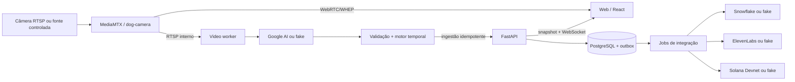
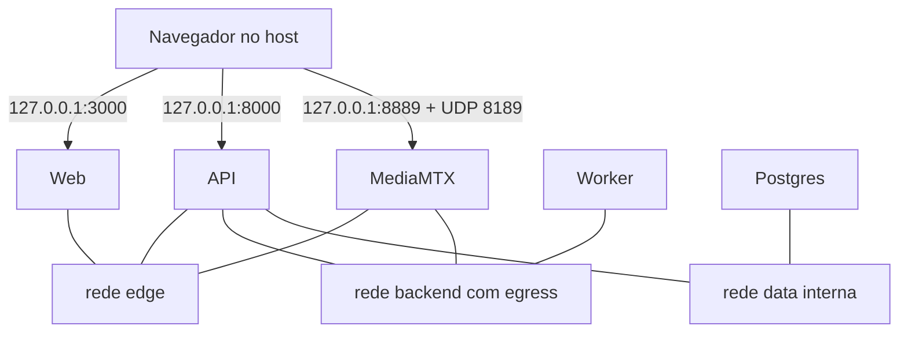

# Arquitetura

## Visão geral

O MVP roda no mesmo host, mas separa vídeo, inferência, domínio transacional e
interface. Essa divisão permite mover o worker para um agente local no futuro sem
alterar o contrato público.

O pipeline de vídeo é independente da inferência. A indisponibilidade de Google
AI expira o último estado para `service_degraded`, mas não deve interromper o
player. Snowflake, voz e receipt são trabalhos derivados e não participam da
transação que publica o estado ao vivo.

## Responsabilidades

| Componente | Responsabilidade | Não deve fazer |
|---|---|---|
| MediaMTX | receber uma publicação RTSP e distribuir RTSP/WebRTC | gravar mídia |
| Video worker | buffer limitado, amostragem, inferência e estabilização | persistir frames |
| API | autenticação, estado, eventos, outbox, WebSocket e integrações | retornar senha RTSP |
| PostgreSQL | fonte operacional da timeline e jobs | armazenar vídeo/áudio binário |
| Web | player, estado provável, evidências e ações acessíveis | acessar secrets |
| Snowflake | histórico pseudonimizado e agregações | dirigir a UI ao vivo |

## Fluxo de uma atualização

1. MediaMTX recebe ou reconecta o stream `dog-camera`.
2. O worker mantém uma janela de quatro segundos, amostra até oito frames e
   descarta janelas antigas quando uma análise ainda está em curso.
3. O adaptador fake ou Google AI retorna `behavior-analysis-v1`.
4. O payload é validado; um resultado inválido não altera o estado.
5. O motor aplica média exponencial (`alpha=0,35`), confiança mínima, margem e
   duas observações consecutivas.
6. A API rejeita análises repetidas ou atrasadas por identidade/sequência.
7. PostgreSQL persiste estado, evento e outbox antes da publicação WebSocket.
8. Jobs fazem retry idempotente das integrações sem bloquear vídeo ou UI.

## Fonte de verdade e consistência

- PostgreSQL é a fonte da timeline e do estado atual.
- O WebSocket é uma notificação; após reconectar, o cliente busca um snapshot.
- Snowflake é eventual e usa `MERGE` por `EVENT_ID`.
- Áudio usa chave de deduplicação por evento, idioma, voz, modelo e template.
- Receipt usa `(event_id, canonical_version, network)` e somente evento encerrado.
- Toda janela carrega `analysis_id`, `session_id` e `camera_id` para correlação.

## Redes e portas do Compose

O banco não possui porta publicada. As portas públicas ligam em localhost por
padrão. `DOGSENSE_BIND_HOST=0.0.0.0` só deve ser usado após hardening de auth,
CORS/Origin e topologia WebRTC.

| Porta | Protocolo | Uso |
|---:|---|---|
| 3000 | HTTP | dashboard |
| 8000 | HTTP/WS | API, health e WebSocket |
| 8554 | RTSP/TCP | publicação/leitura local do relay |
| 8889 | HTTP | sinalização WHEP/WebRTC |
| 8189 | UDP | mídia WebRTC |
| 5432 | TCP interno | PostgreSQL, nunca publicado |
| 9997/9998 | HTTP interno | Control API/métricas do MediaMTX |

## Modos e degradação

O modo demo combina MediaMTX e PostgreSQL reais com fonte sintética e adaptadores
fake. Cada integração pode ser promovida separadamente para `real`.

| Falha | Estado/ação | Continua funcionando |
|---|---|---|
| câmera/relay | `camera_offline`, reconexão com backoff | API, UI e histórico |
| stream congelado | `stream_unstable`, descarta frames antigos | UI e diagnóstico |
| IA timeout/inválida | retry único, depois `service_degraded` | vídeo e último snapshot por 10 s |
| Snowflake | outbox pendente com backoff | vídeo, estado e timeline PostgreSQL |
| ElevenLabs | mensagem textual e retry permitido | todo o fluxo visual |
| Solana | receipt `pending`/`failed` | evento e demais integrações |

## Limites de recursos

- uma análise simultânea por câmera;
- ring buffer e fila limitados;
- janela mais recente vence;
- logs rotacionados no Docker (`3 × 10 MiB` por serviço);
- cache de áudio em volume, TTL esperado de 24 horas;
- gravação de MediaMTX explicitamente desligada.

## Evolução

Na topologia futura, o Edge Agent permanece ao lado da câmera, conserva a
credencial RTSP localmente e envia apenas eventos/telemetria necessários por uma
conexão de saída. A API e os contratos atuais continuam sendo a fronteira entre
observação local e serviços remotos.

